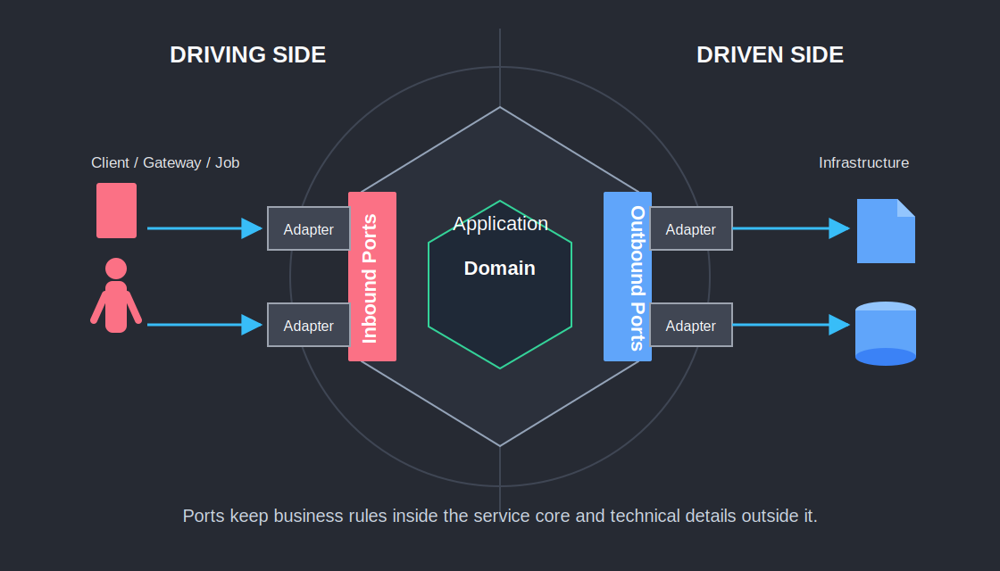
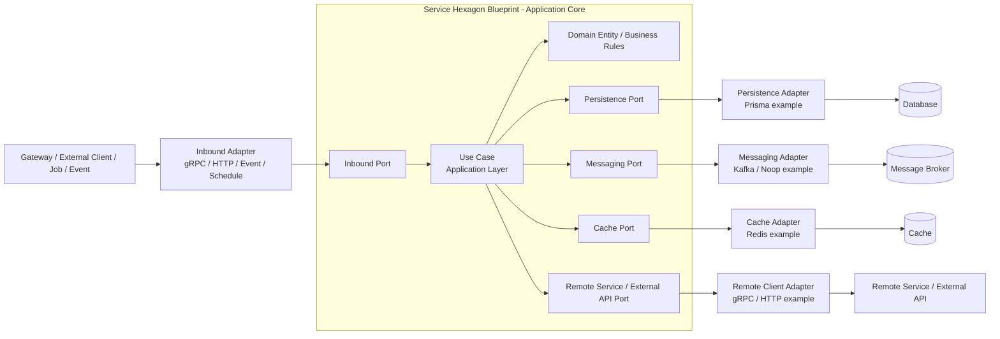
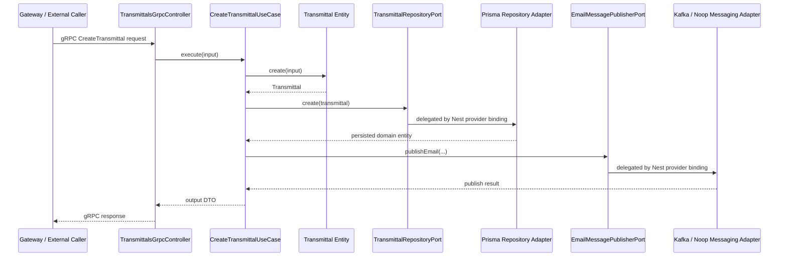
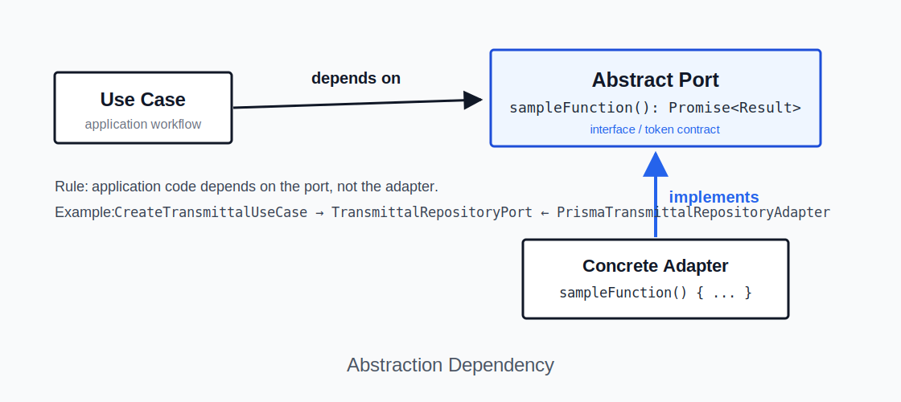
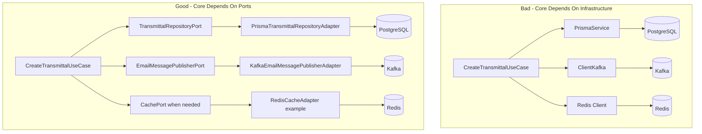
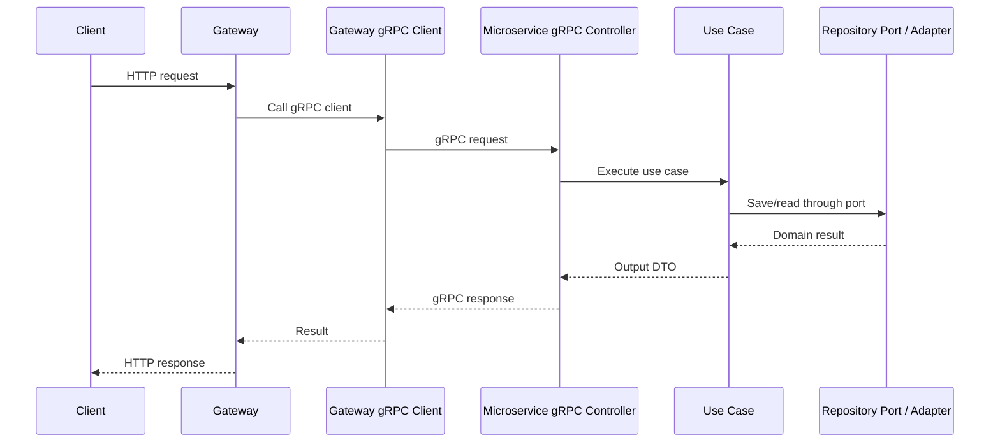
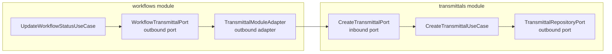
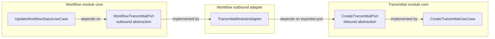

# Service Hexagon Blueprint

NestJS microservice reference for service-owned business rules, ports, adapters, and infrastructure boundaries.

## 1. Document Control

| Field | Value |
|---|---|
| Title | Service Hexagon Blueprint |
| Descriptive Subtitle | NestJS Microservice Hexagonal Architecture Reference |
| Project | `nestjs-hexagonal-service` |
| POC Name | Service Hexagon Blueprint |
| Version | 1.0 |
| Status | Draft / Reference |
| Owner | `<Architecture Owner / Technical Lead>` |
| Review Cycle | Quarterly, or before major architectural changes |
| Last Updated | `<YYYY-MM-DD>` |
| Intended Audience | Backend developers, NestJS engineers, technical leads, solution architects, QA engineers, DevOps engineers, reviewers, maintainers |
| Related Repositories / Documents | `nestjs-hexagonal-service`, service SRS/BRD where applicable, API contracts, gRPC proto files, ADRs, operational runbooks |

### Change History

| Version | Date | Author | Summary | Review Status |
|---|---|---|---|---|
| 0.1 | `<YYYY-MM-DD>` | `<Author>` | Initial draft | Pending review |
| 1.0 | `<YYYY-MM-DD>` | `<Author>` | Baseline architecture reference | Pending approval |

---

## 2. Executive Summary

This document explains the architecture of a sample NestJS service named `nestjs-hexagonal-service`. The POC/reference name for this architecture guide is **Service Hexagon Blueprint**. The project demonstrates **Hexagonal Architecture**, also known as **Ports and Adapters Architecture**, in a practical NestJS microservice-style codebase.

The service contains example modules such as:

```txt
src/modules/transmittals
src/modules/workflows
src/infrastructure/database/prisma
src/infrastructure/messaging
src/common
src/config
src/shared
```

The purpose of the project is to show how a NestJS service can organize business rules, use cases, ports, adapters, and infrastructure-specific code without tightly coupling the business logic to any one technical mechanism. Infrastructure includes framework/runtime, transport, persistence, messaging, cache, file or object storage, search indexes, external APIs, remote microservice clients, observability, configuration, secrets, schedulers, queues, and other technical details outside the application core. Prisma, Kafka, Redis, gRPC, and NestJS controllers are examples, not the full boundary.

This project is a **sample, starter, boilerplate, and proof of concept**. It is not intended to be copied blindly into production. Future teams may reuse the architecture idea, dependency direction, folder structure, and implementation patterns after project-specific cleanup, review, testing, security hardening, and refactoring.

The architecture was chosen to support:

| Objective | Explanation |
|---|---|
| Maintainability | Business logic remains separated from framework, transport, persistence, messaging, cache, external API, and other infrastructure code. |
| Testability | Use cases can be tested with mocked ports without real infrastructure such as a database, broker, cache server, remote service, or transport server. |
| Replaceability | Infrastructure technologies such as Prisma, Kafka, Redis, gRPC, object storage, search, or external APIs can be replaced through adapters. |
| Explicit boundaries | Each module owns its domain rules, use cases, ports, and adapters. |
| Auditability | The architecture creates traceable paths from requirement to use case to port to adapter to test. |

This document should be used as a developer guide, architecture reference, onboarding material, and review checklist. It is ISO-friendly in structure and documentation discipline, but it does **not** claim ISO certification, ISO conformance, or audit approval.

---

## 3. Goals And Non-Goals

### 3.1 Goals

| Goal | Description |
|---|---|
| Maintainability | Keep business logic understandable and isolated from technical details. |
| Testability | Allow domain and use case tests without infrastructure dependencies. |
| Infrastructure independence | Avoid placing business rules directly inside framework/runtime, transport, persistence, messaging, cache, external API, or remote-service client code. |
| Persistence independence | Use repository ports so use cases do not depend directly on a specific database, ORM, or query client such as Prisma. |
| Integration independence | Use outbound ports so use cases do not depend directly on brokers, cache clients, file storage clients, search clients, external API clients, or raw gRPC clients. |
| Clear business boundaries | Each module should express its own domain, use cases, inbound ports, and outbound ports. |
| Production starter | Provide a starting structure that can be hardened for production. |
| Developer onboarding | Help developers familiar with default NestJS folder structures understand hexagonal layering. |
| Audit-friendly documentation | Support traceability, reviewability, and maintainability. |

### 3.2 Non-Goals

This project is not intended to be:

| Non-Goal | Explanation |
|---|---|
| A complete enterprise platform | It demonstrates patterns, not a full EDMS implementation. |
| A universal shared business module library | Shared modules should not become dumping grounds for business logic. |
| A final production design | Production use requires review, cleanup, security hardening, observability, scaling, and test coverage. |
| A replacement for requirement analysis | Business-specific rules must still be discovered, validated, and documented. |
| A gateway architecture guide | The focus is service/microservice architecture. A gateway may route or enrich requests, but it should not own service business rules. |
| The only correct architecture | Hexagonal Architecture is one appropriate approach for complex business services, not the only possible design. |

---

## 4. Prerequisites For Developers

Developers using this architecture should understand the following concepts.

### 4.1 NestJS Modules, Providers, And Dependency Injection

NestJS uses modules and providers to register dependencies.

```ts
@Module({
  providers: [
    CreateTransmittalUseCase,
    {
      provide: TRANSMITTAL_REPOSITORY_PORT,
      useClass: PrismaTransmittalRepositoryAdapter,
    },
  ],
})
export class TransmittalsModule {}
```

The use case depends on a token/interface, while Nest injects the concrete adapter at runtime.

### 4.2 TypeScript Interfaces, Types, And Classes

Ports are usually TypeScript interfaces.

```ts
export interface TransmittalRepositoryPort {
  findById(id: string): Promise<Transmittal | null>;
}
```

Classes implement those interfaces.

```ts
export class PrismaTransmittalRepositoryAdapter
  implements TransmittalRepositoryPort {
  // implementation
}
```

### 4.3 Basic OOP

| Concept | Usage In This Architecture |
|---|---|
| Class | Domain entities, use cases, adapters |
| Interface | Ports |
| Encapsulation | Domain rules stay inside domain/application layers |
| Composition | Modules compose providers and adapters |
| Inheritance | Optional base classes such as `BasePrismaRepository` |

### 4.4 SOLID Principles

The most important SOLID principle here is **Dependency Inversion**.

High-level business logic should not depend on low-level technical details.

Bad:

```ts
export class CreateTransmittalUseCase {
  constructor(private readonly prisma: PrismaService) {}
}
```

Good:

```ts
export class CreateTransmittalUseCase {
  constructor(
    @Inject(TRANSMITTAL_REPOSITORY_PORT)
    private readonly repository: TransmittalRepositoryPort,
  ) {}
}
```

### 4.5 DTOs Vs Domain Entities

DTOs are used to carry data across boundaries. Domain entities contain business state and business rules.

Bad:

```ts
const transmittal = createTransmittalDto;
```

Good:

```ts
const transmittal = Transmittal.create({
  projectId: input.projectId,
  subject: input.subject,
  documentIds: input.documentIds,
});
```

### 4.6 Persistence Mapping

Prisma models are persistence structures. Domain entities are business structures.

```txt
Prisma Row → Domain Entity
Domain Entity → Prisma Data
```

### 4.7 Testing Basics

| Test Type | Example |
|---|---|
| Unit test | Test `Transmittal.create()` without NestJS |
| Use case test | Test `CreateTransmittalUseCase` with mocked ports |
| Adapter test | Test Prisma adapter with test database |
| Contract test | Test gRPC request/response expectations |
| E2E test | Test service runtime behavior through gRPC |

### 4.8 Common Mistakes From Default NestJS Structure

Default NestJS structure often becomes:

```txt
controller → service → repository → database
```

This can work for simple CRUD applications, but in complex systems it may cause the service to know Prisma, Kafka, Redis, HTTP exceptions, and external APIs. Hexagonal Architecture separates those responsibilities.

---

## 5. Core Philosophy

The core philosophy is:

```txt
Business logic should be stable.
Technology should be replaceable.
```

The service is divided into two major areas.

```txt
Inside the hexagon:
  Domain
  Use cases
  Ports

Outside the hexagon:
  gRPC controllers
  Prisma repositories
  Kafka publishers
  Redis caches
  remote service clients
  file/object storage clients
  search index clients
  external APIs
  observability/logging integrations
  configuration and secrets integrations
  framework-specific code
```

### 5.1 Hexagon / Application Core

The application core contains business rules and use case orchestration.

Examples:

```txt
src/modules/transmittals/domain
src/modules/transmittals/application
src/modules/transmittals/ports
```

The core should not know the implementation details of Prisma, Kafka, Redis, gRPC clients, file storage, search, external APIs, observability tools, or any other infrastructure technology.

### 5.2 Ports

A port is an interface that defines a boundary.

| Port Type | Meaning | Example |
|---|---|---|
| Inbound port | What the application can do | `CreateTransmittalPort` |
| Outbound port | What the application needs from outside | `TransmittalRepositoryPort` |

### 5.3 Adapters

Adapters are technical implementations of ports.

| Port | Adapter |
|---|---|
| `TransmittalRepositoryPort` | `PrismaTransmittalRepositoryAdapter` |
| `EmailMessagePublisherPort` | `KafkaEmailMessagePublisherAdapter` |
| `EmailMessagePublisherPort` | `NoopEmailMessagePublisherAdapter` |
| gRPC inbound contract | `TransmittalsGrpcController` |

### 5.4 Dependency Rule

```txt
Outer layers may depend on inner layers.
Inner layers must not depend on outer layers.
```

Good:

```txt
Prisma adapter imports domain entity.
Use case imports repository port.
Controller imports use case.
```

Bad:

```txt
Domain entity imports Prisma model.
Use case imports Kafka client.
Use case imports raw ClientGrpc.
Gateway owns service business rule.
```

### 5.5 Infrastructure As Detail

Infrastructure is everything outside the application core that helps the service run, communicate, persist, cache, observe, or integrate.

Examples include:

- Framework/runtime: NestJS modules, controllers, providers, lifecycle hooks.
- Transport: gRPC, HTTP, event consumers, scheduled jobs.
- Persistence: PostgreSQL, Prisma, raw SQL, document databases.
- Messaging: Kafka, RabbitMQ, SQS, pub/sub systems.
- Cache: Redis, in-memory cache, distributed cache.
- External integrations: REST/gRPC clients, file storage, object storage, search indexes.
- Operations: logging, metrics, tracing, secrets, configuration.

NestJS is important at runtime, but it should not dominate domain rules. Domain entities should not use `@Injectable()`, `@Controller()`, `@GrpcMethod()`, request validation decorators, Prisma models, Kafka clients, Redis clients, or remote-service clients.

### 5.6 Persistence, Messaging, Cache, And Integrations As Details

The database is an implementation detail behind repository ports. Messaging is an implementation detail behind publisher/consumer ports. Cache is an implementation detail behind cache/query ports when cache is required. Remote service calls are implementation details behind outbound client ports.

The same rule applies to any infrastructure mechanism:

```txt
Use case depends on a port.
Adapter implements the port.
Adapter owns technology-specific code.
```

### 5.7 Explicit Mapping Between Layers

Mapping is intentional.

```txt
gRPC request DTO → Use case input DTO
Use case output DTO → gRPC response
Prisma row → Domain entity
Domain entity → Prisma persistence data
Domain/application event → Kafka payload
Cache entry → Application/domain-friendly shape
Remote service response → Application output or domain-friendly shape
```

---

## 6. Architecture Overview

### 6.1 High-Level Diagram





### 6.2 Request Flow Example: Create Transmittal

```txt
Gateway or external caller
  → gRPC request
  → TransmittalsGrpcController
  → CreateTransmittalUseCase
  → Transmittal domain entity
  → TransmittalRepositoryPort
  → PrismaTransmittalRepositoryAdapter
  → PostgreSQL
  → EmailMessagePublisherPort
  → KafkaEmailMessagePublisherAdapter / NoopEmailMessagePublisherAdapter
```



### 6.3 Dependency Flow

Compile-time dependency should look like this:

```txt
adapters → application → domain
adapters → ports
application → ports
domain → no infrastructure
```

Runtime call flow may go outward because the use case calls a port and Nest resolves the adapter.

### 6.4 Gateway Boundary

A gateway, when present, is outside this service hexagon. It may handle routing, authentication, authorization, request enrichment, aggregation, rate limiting, and tenant extraction. It should not own workflow rules, transmittal rules, document register state transitions, approval rules, or retention rules.

### 6.5 Services As Main Architectural Units

Each service should own its domain rules, use cases, ports, adapters, configuration, tests, and contracts.

---

## 7. Folder Structure

### 7.1 Recommended Structure

```txt
src/
  app.module.ts

  modules/
    transmittals/
      domain/
        entities/
        exceptions/

      application/
        dto/
          inputs/
          outputs/
        use-cases/

      ports/
        in/
        out/

      adapters/
        in/
          grpc/
            controllers/
            dto/
            proto/
        out/
          persistence/
            prisma/

      transmittals.module.ts

    workflows/
      domain/
      application/
      ports/
      adapters/
      workflows.module.ts

  infrastructure/
    database/
      prisma/
        repositories/
        prisma.module.ts
        prisma.service.ts

    messaging/
      ports/
      adapters/
        kafka/
        noop/
      providers/
      messaging.module.ts

  common/
    exceptions/
    filters/
    ports/

  shared/
    utils/
    constants/

  config/
    env.validation.ts
    grpc-contracts.config.ts
```

### 7.2 Layer Responsibilities

| Folder | Responsibility |
|---|---|
| `domain` | Business entities, invariants, domain exceptions |
| `application` | Use cases and application DTOs |
| `ports/in` | Capabilities exposed by the module |
| `ports/out` | External capabilities required by the module |
| `adapters/in` | gRPC/HTTP/message/cron controllers that invoke use cases |
| `adapters/out` | Infrastructure-specific implementations of ports, such as persistence, messaging, cache, file storage, external API, or remote service clients |
| `infrastructure` | Shared technical implementation such as Prisma, Kafka, Redis, config, lifecycle, cache, and other runtime integrations |
| `common` | Cross-cutting exceptions, filters, and common ports |
| `shared` | Stable utilities and constants |
| `config` | Environment validation and runtime contract registration |

### 7.3 Path Aliases

Recommended aliases:

| Alias | Target |
|---|---|
| `@modules/*` | `src/modules/*` |
| `@infra/*` | `src/infrastructure/*` |
| `@common/*` | `src/common/*` |
| `@shared/*` | `src/shared/*` |
| `@config/*` | `src/config/*` |

### 7.4 Recommended Structure For A New Module

```txt
src/modules/<module-name>/
  domain/
    entities/
    exceptions/

  application/
    dto/
      inputs/
      outputs/
    use-cases/

  ports/
    in/
    out/

  adapters/
    in/
      grpc/
        controllers/
        dto/
        proto/
    out/
      persistence/
        prisma/
      messaging/
      cache/
      grpc-client/

  <module-name>.module.ts
```

---

## 8. Naming Conventions

| Element | Convention | Good Example | Bad Example |
|---|---|---|---|
| Folder | lowercase plural | `transmittals` | `TransmittalModule` |
| File | kebab-case | `create-transmittal.use-case.ts` | `CreateTransmittalUsecase.ts` |
| Class | PascalCase with responsibility | `CreateTransmittalUseCase` | `TransmittalManager` |
| Interface | descriptive port name | `TransmittalRepositoryPort` | `IRepo` |
| Token | uppercase symbol | `TRANSMITTAL_REPOSITORY_PORT` | `repo` |
| Use case | verb + business action | `update-workflow-status.use-case.ts` | `workflow.processor.ts` |
| Adapter | technology + capability | `KafkaEmailMessagePublisherAdapter` | `KafkaService` |
| DTO | direction and purpose | `CreateTransmittalInput` | `DataDto` |
| Entity | business noun | `Transmittal` | `TransmittalModel` |
| Exception | layer and purpose | `TransmittalDomainException` | `CustomError` |
| Test | `.spec.ts` | `create-transmittal.use-case.spec.ts` | `test.ts` |
| Proto | module name | `transmittal.proto` | `service.proto` |

Define each symbol injection token once and import it everywhere. `Symbol('TOKEN') !== Symbol('TOKEN')` if created in two files.

---

## 9. Component Responsibilities

### 9.1 Domain Entities

Domain entities represent business concepts and rules.

```ts
export class Transmittal {
  static create(params: CreateParams): Transmittal {
    if (!params.subject?.trim()) {
      throw new TransmittalDomainException(
        'Subject is required',
        'SUBJECT_REQUIRED',
      );
    }

    return new Transmittal(/* ... */);
  }
}
```

They should not save to databases, publish broker messages, read/write cache, call external APIs, read environment variables, or know NestJS decorators.

### 9.2 Domain Exceptions

Domain exceptions represent violated business rules.

```ts
throw new TransmittalDomainException(
  'Subject is required',
  'SUBJECT_REQUIRED',
);
```

### 9.3 Use Cases

Use cases orchestrate application behavior:

```txt
validate application-level rules
load data through ports
call domain entity behavior
save through repository port
publish events through messaging port
return output DTO
```

### 9.4 Input And Output DTOs

Input DTOs define what a use case needs.

```ts
export interface CreateTransmittalInput {
  projectId: string;
  subject: string;
  documentIds: string[];
  recipientIds: string[];
  createdBy: string;
}
```

Output DTOs define what a use case returns.

```ts
export interface CreateTransmittalOutput {
  id: string;
  transmittalNumber: string;
  status: string;
  createdAt: string;
}
```

### 9.5 Inbound Ports

Inbound ports define callable application capabilities.

```ts
export interface CreateTransmittalPort {
  execute(input: CreateTransmittalInput): Promise<CreateTransmittalOutput>;
}
```

### 9.6 Outbound Ports

Outbound ports define external needs.

```ts
export interface TransmittalRepositoryPort {
  create(transmittal: Transmittal): Promise<Transmittal>;
}
```

```ts
export interface EmailMessagePublisherPort {
  publishEmail(input: KafkaEmailBody): Promise<void>;
}
```

### 9.7 Controllers

Controllers are inbound adapters. They receive protocol-specific requests, map to use case input, call use cases, and map output to protocol responses. They should not contain business rules, call persistence directly, publish broker messages directly, read/write cache directly, call remote services directly, or decide workflow state transitions.

### 9.8 Repository Adapters

Repository adapters call the selected persistence technology, such as Prisma in this POC, map rows to domain entities, map domain entities to persistence data, and implement business-specific queries required by the port.

### 9.9 Database Ports And Abstract Repository Handling

This POC demonstrates two repository abstraction levels:

| Level | File | Responsibility |
|---|---|---|
| Generic repository contract | `src/common/ports/base-repository.port.ts` | Defines common persistence operations that many repositories may share. |
| Module-specific repository port | `src/modules/<module>/ports/out/*.repository.port.ts` | Defines business-specific persistence needs for one module. |
| Abstract Prisma base repository | `src/infrastructure/database/prisma/repositories/base-prisma.repository.ts` | Provides reusable Prisma-backed implementations for common repository methods. |
| Concrete module repository adapter | `src/modules/<module>/adapters/out/persistence/*repository.adapter.ts` | Implements the module-specific port and maps between domain and persistence. |

The dependency direction is:

```txt
Use case
  → module-specific repository port
    ← concrete repository adapter
      → abstract base repository helpers
        → PrismaService
          → database
```

The use case should only know the module-specific port:

```ts
constructor(
  @Inject(TRANSMITTAL_REPOSITORY_PORT)
  private readonly transmittalRepository: TransmittalRepositoryPort,
) {}
```

The module-specific port may extend a common base contract when useful:

```ts
export interface BaseRepositoryPort<TDomain> {
  findAll(): Promise<TDomain[]>;
  findById(id: string): Promise<TDomain | null>;
  create(entity: TDomain): Promise<TDomain>;
  save(entity: TDomain): Promise<TDomain>;
  update(id: string, entity: Partial<TDomain>): Promise<TDomain | null>;
  delete(id: string): Promise<boolean>;
  softDelete(id: string): Promise<boolean>;
  exists(id: string): Promise<boolean>;
}
```

The abstract Prisma repository contains common technical behavior:

```ts
export abstract class BasePrismaRepository<TDomain extends { id: string }, TPersistence>
  implements BaseRepositoryPort<TDomain>
{
  constructor(
    protected readonly prisma: PrismaService,
    private readonly modelName: string,
    private readonly options: BasePrismaRepositoryOptions = {},
  ) {}

  protected abstract toDomain(row: TPersistence): TDomain;

  protected abstract toPersistence(entity: Partial<TDomain>): Record<string, unknown>;
}
```

The important design point is that the abstract class does not remove the need for module-specific repository ports. Common CRUD methods can live in the base class, but business-specific queries should remain explicit in the module repository port.

Example:

```ts
export interface TransmittalRepositoryPort
  extends BaseRepositoryPort<Transmittal> {
  existByProjectAndSubject(projectId: string, subject: string): Promise<boolean>;
}
```

The concrete adapter then extends the abstract class and implements module-specific mapping and queries:

```ts
@Injectable()
export class PrismaTransmittalRepositoryAdapter
  extends BasePrismaRepository<Transmittal, TransmittalPersistence>
  implements TransmittalRepositoryPort
{
  constructor(prisma: PrismaService) {
    super(prisma, 'transmittal');
  }

  async existByProjectAndSubject(projectId: string, subject: string): Promise<boolean> {
    return this.existsByWhere({
      projectId,
      subject: {
        equals: subject.trim(),
        mode: 'insensitive',
      },
    });
  }

  protected toDomain(row: TransmittalPersistence): Transmittal {
    return new Transmittal(/* mapped fields */);
  }

  protected toPersistence(entity: Partial<Transmittal>): Record<string, unknown> {
    return { /* mapped fields */ };
  }
}
```

Use this pattern carefully:

- Put shared, technical CRUD behavior in `BasePrismaRepository`.
- Put module-specific business queries in the module repository port.
- Keep `toDomain` and `toPersistence` explicit in the concrete adapter.
- Do not expose Prisma models or Prisma query details to use cases.
- Do not force every repository to extend the base class if the module has different persistence needs.
- Do not hide meaningful business queries behind generic dynamic methods.

### 9.10 Messaging Adapters

Messaging adapters implement messaging ports and hide Kafka/RabbitMQ/SQS or other broker details.

### 9.11 Cache And External Service Adapters

Cache adapters implement cache-related ports and hide Redis or other cache clients. External service adapters implement outbound ports for remote microservices, third-party APIs, file/object storage, search indexes, or any other external integration. Use cases should depend on these ports, not concrete infrastructure SDKs.

### 9.12 Nest Modules

Nest modules wire dependencies.

```ts
@Module({
  providers: [
    CreateTransmittalUseCase,
    {
      provide: TRANSMITTAL_REPOSITORY_PORT,
      useClass: PrismaTransmittalRepositoryAdapter,
    },
  ],
})
export class TransmittalsModule {}
```

### 9.13 Persistence Services And Repositories

`PrismaService` manages database connection lifecycle in this POC. `BasePrismaRepository` may contain common CRUD helpers. Module-specific persistence adapters should contain model name, domain mapping, persistence mapping, and business-specific queries.

### 9.14 Configuration And Lifecycle Services

Configuration should validate required environment variables. Lifecycle hooks should close database connections, broker clients, cache clients, remote service clients, cron jobs, and external connections.

---

## 10. Dependency Inversion In This Project

### 10.1 Core Idea

```txt
High-level business logic should depend on abstractions.
Low-level infrastructure should implement those abstractions.
```

### 10.2 Diagram





### 10.3 Correct Example

```ts
@Injectable()
export class CreateTransmittalUseCase {
  constructor(
    @Inject(TRANSMITTAL_REPOSITORY_PORT)
    private readonly repository: TransmittalRepositoryPort,

    @Inject(EMAIL_MESSAGE_PUBLISHER_PORT)
    private readonly emailPublisher: EmailMessagePublisherPort,
  ) {}
}
```

### 10.4 Incorrect Example

```ts
@Injectable()
export class CreateTransmittalUseCase {
  constructor(
    private readonly prisma: PrismaService,
    private readonly kafkaClient: ClientKafka,
  ) {}
}
```

### 10.5 Nest Provider Binding

```ts
{
  provide: TRANSMITTAL_REPOSITORY_PORT,
  useClass: PrismaTransmittalRepositoryAdapter,
}
```

This tells Nest: when something asks for `TRANSMITTAL_REPOSITORY_PORT`, provide `PrismaTransmittalRepositoryAdapter`.

---

## 11. Communication Scenarios

### 11.1 Scenario 1: Gateway To Microservice Over gRPC

The gateway is external to the service hexagon.

Flow:

```txt
HTTP Client
  → Gateway Controller
  → Gateway gRPC Client
  → Microservice gRPC Controller
  → Use Case
  → Domain / Ports / Adapters
```



Correct:

```txt
Gateway enriches request with current user ID.
Microservice validates and applies business rules.
```

Incorrect:

```txt
Gateway checks whether workflow can be completed.
Gateway creates transmittal business records directly.
Gateway decides document approval rules.
```

### 11.2 Scenario 2: Inter-Module Communication Inside One Microservice

This is the scenario that most often causes confusion, because the call stays inside one deployed microservice but crosses a module boundary.

The important rule is:

```txt
From the caller module's point of view, another module is outside its core.
From the called module's point of view, its use case is an inbound capability.
```

In this POC:

- `workflows` owns workflow rules.
- `transmittals` owns transmittal creation rules.
- `workflows` should not create transmittals by directly using the transmittal repository.
- `workflows` should ask the `transmittals` module to perform its own use case.

Example business flow:

```txt
Workflow status changes to COMPLETED.
Workflow module creates a transmittal through Transmittal module.
```

#### How To Think About The Ports

There are two module perspectives.

| Perspective | Question | Port Direction | Example In This Project |
|---|---|---|---|
| Calling module: `workflows` | What external capability do I need? | Outbound port | `WORKFLOW_TRANSMITTAL_PORT` / `WorkflowTransmittalPort` |
| Called module: `transmittals` | What application capability do I expose? | Inbound port | `CREATE_TRANSMITTAL_PORT` / `CreateTransmittalPort` |
| Adapter between them | How do I translate the workflow need into the transmittal capability? | Outbound adapter from `workflows` | `TransmittalModuleAdapter` |

This is not contradictory. The same runtime call is outbound for the caller and inbound for the called module.

#### Correct Flow

```txt
UpdateWorkflowStatusUseCase
  → WorkflowTransmittalPort
  → TransmittalModuleAdapter
  → CreateTransmittalPort
  → CreateTransmittalUseCase
```



#### Where Each File Lives

| File | Module | Layer | Why It Lives There |
|---|---|---|---|
| `src/modules/workflows/ports/out/workflow-transmittal.port.ts` | `workflows` | Outbound port | Workflows says, "I need a way to create a transmittal, but I do not care how." |
| `src/modules/workflows/adapters/out/transmittals/transmittal-module.adapter.ts` | `workflows` | Outbound adapter | Adapts the workflow module's need to the transmittal module's public use-case port. |
| `src/modules/transmittals/ports/in/create-transmittal.port.ts` | `transmittals` | Inbound port | Transmittals says, "This is the safe application operation I expose." |
| `src/modules/transmittals/application/use-cases/create-transmittal.use-case.ts` | `transmittals` | Use case | Owns transmittal creation rules and orchestration. |
| `src/modules/transmittals/ports/out/transmittal.repository.port.ts` | `transmittals` | Outbound port | Transmittal use case needs persistence without depending on Prisma. |
| `src/modules/transmittals/adapters/out/persistence/prisma-transmittal.repository.adapter.ts` | `transmittals` | Outbound adapter | Implements persistence details for the transmittal module. |

#### Caller-Side Outbound Port

The workflow module defines its need in its own language:

```ts
export const WORKFLOW_TRANSMITTAL_PORT = Symbol('WORKFLOW_TRANSMITTAL_PORT');

export interface WorkflowTransmittalPort {
  createTransmittal(input: CreateWorkflowTransmittalInput): Promise<WorkflowTransmittalOutput>;
}
```

This port belongs to `workflows` because the workflow use case owns the dependency.

The workflow use case depends on this port:

```ts
@Injectable()
export class UpdateWorkflowStatusUseCase {
  constructor(
    @Inject(WORKFLOW_TRANSMITTAL_PORT)
    private readonly workflowTransmittal: WorkflowTransmittalPort,
  ) {}

  async execute(input: UpdateWorkflowStatusInput): Promise<WorkflowOutput> {
    // workflow validation and workflow rules happen here

    const transmittal = await this.workflowTransmittal.createTransmittal({
      projectId: workflow.projectId,
      subject: workflow.subject,
      documentIds: workflow.documentIds,
      recipientIds: workflow.recipientIds,
      dueDate: workflow.dueDate ?? undefined,
      remarks: workflow.remarks ?? undefined,
      createdBy: workflow.createdBy,
    });

    // workflow completion continues here
  }
}
```

The workflow use case does not know:

- `CreateTransmittalUseCase`
- `PrismaTransmittalRepositoryAdapter`
- `PrismaService`
- transmittal persistence details
- transmittal controller details

#### Called-Side Inbound Port

The transmittals module exposes a safe application capability:

```ts
export const CREATE_TRANSMITTAL_PORT = Symbol('CREATE_TRANSMITTAL_PORT');

export interface CreateTransmittalPort {
  execute(input: CreateTransmittalInput): Promise<CreateTransmittalOutput>;
}
```

This port belongs to `transmittals` because the transmittals module owns the use case.

The module exports this port:

```ts
@Module({
  providers: [
    CreateTransmittalUseCase,
    {
      provide: CREATE_TRANSMITTAL_PORT,
      useExisting: CreateTransmittalUseCase,
    },
  ],
  exports: [CREATE_TRANSMITTAL_PORT],
})
export class TransmittalsModule {}
```

Exporting the inbound port means other modules can call the application capability without importing the concrete use case class directly.

#### Adapter Between Modules

The adapter lives in the caller module because it satisfies the caller module's outbound port.

```ts
@Injectable()
export class TransmittalModuleAdapter implements WorkflowTransmittalPort {
  constructor(
    @Inject(CREATE_TRANSMITTAL_PORT)
    private readonly createTransmittalPort: CreateTransmittalPort,
  ) {}

  async createTransmittal(
    input: CreateWorkflowTransmittalInput,
  ): Promise<WorkflowTransmittalOutput> {
    return this.createTransmittalPort.execute({
      projectId: input.projectId,
      subject: input.subject,
      documentIds: input.documentIds,
      recipientIds: input.recipientIds,
      dueDate: input.dueDate,
      remarks: input.remarks,
      createdBy: input.createdBy,
    });
  }
}
```

This adapter is small, but it is useful because it is an anti-corruption layer between module languages:

- `workflows` can use `CreateWorkflowTransmittalInput`.
- `transmittals` can use `CreateTransmittalInput`.
- Mapping happens at the boundary.
- Future changes in `transmittals` do not automatically leak into workflow use cases.

#### Module Wiring

The caller module imports the called module and binds its own outbound port to the adapter:

```ts
@Module({
  imports: [PrismaModule, TransmittalsModule],
  providers: [
    UpdateWorkflowStatusUseCase,
    {
      provide: WORKFLOW_TRANSMITTAL_PORT,
      useClass: TransmittalModuleAdapter,
    },
  ],
})
export class WorkflowsModule {}
```

At runtime, Nest resolves the chain:

```txt
UpdateWorkflowStatusUseCase
  asks for WORKFLOW_TRANSMITTAL_PORT
  gets TransmittalModuleAdapter
  adapter asks for CREATE_TRANSMITTAL_PORT
  gets CreateTransmittalUseCase
```

#### Dependency Inversion Thinking

The dependency inversion idea in this inter-module case is:

```txt
The workflow use case should depend on what it needs,
not on the concrete module, concrete use case, or concrete repository that satisfies it.
```

Think about it in two levels.

Level 1: `workflows` protects its own use case from the concrete transmittal module implementation.

```txt
UpdateWorkflowStatusUseCase
  depends on
WorkflowTransmittalPort
  implemented by
TransmittalModuleAdapter
```

Level 2: `TransmittalModuleAdapter` bridges to the public application contract exposed by `transmittals`.

```txt
TransmittalModuleAdapter
  depends on
CreateTransmittalPort
  implemented by
CreateTransmittalUseCase
```

The adapter is the only class that knows both sides:

- It knows the workflow-side outbound port: `WorkflowTransmittalPort`.
- It knows the transmittal-side inbound port: `CreateTransmittalPort`.
- It maps workflow input into transmittal input.
- It prevents workflow use cases from depending on transmittal internals.



Simple reading:

```txt
Use case → own module outbound port → own module adapter → other module inbound port → other module use case
```

Dependency inversion is preserved because:

- The workflow use case depends on `WorkflowTransmittalPort`, not `TransmittalModuleAdapter`.
- The workflow use case does not depend on `CreateTransmittalUseCase`.
- The workflow use case does not depend on transmittal persistence.
- The transmittal module exposes a stable inbound port and can change its internal implementation.
- The adapter is replaceable. For example, tomorrow it could call a remote transmittal microservice instead of an in-process module, while `UpdateWorkflowStatusUseCase` stays unchanged.

If the dependency direction feels confusing, ask this:

```txt
Can I unit test UpdateWorkflowStatusUseCase by mocking WorkflowTransmittalPort?
```

If yes, the workflow use case is protected. That is the practical value of dependency inversion here.

#### Why Not Inject The Transmittal Repository?

Bad:

```ts
export class UpdateWorkflowStatusUseCase {
  constructor(
    private readonly transmittalRepository: PrismaTransmittalRepositoryAdapter,
  ) {}
}
```

Problems:

- Workflow bypasses `CreateTransmittalUseCase`.
- Transmittal creation rules may be skipped.
- Workflow becomes coupled to transmittal persistence.
- Prisma details leak across module boundaries.
- Future changes in transmittal storage can break workflow logic.

#### Why Not Inject `CreateTransmittalUseCase` Directly?

This is better than injecting a repository, but still not the preferred module boundary.

```ts
constructor(private readonly createTransmittalUseCase: CreateTransmittalUseCase) {}
```

Problems:

- The caller depends on a concrete class from another module.
- The called module cannot easily change its implementation behind a stable token.
- The dependency is less explicit as a public module contract.
- Testing the caller requires knowledge of the concrete use case.

Prefer the exported inbound port:

```ts
@Inject(CREATE_TRANSMITTAL_PORT)
private readonly createTransmittalPort: CreateTransmittalPort
```

#### Thinking Rule

Use this decision rule:

```txt
If Module A needs Module B to perform business behavior:
  Module A defines an outbound port for what it needs.
  Module B exposes an inbound port for what it safely allows.
  Module A owns an outbound adapter that calls Module B's inbound port.
```

Do not create inter-module ports for simple shared constants, pure utility functions, or trivial type reuse. Use this pattern when crossing a real business boundary.

### 11.3 Scenario 3: Microservice-To-Microservice Direct Communication Without Gateway

Correct flow:

```txt
Calling Service Use Case
  → UserDirectoryPort
  → UserDirectoryGrpcClientAdapter
  → Remote UserService gRPC Controller
  → Remote User Use Case
```

Incorrect:

```ts
@Injectable()
export class CreateTransmittalUseCase {
  constructor(private readonly clientGrpc: ClientGrpc) {}
}
```

Correct:

```ts
@Injectable()
export class CreateTransmittalUseCase {
  constructor(
    @Inject(USER_DIRECTORY_PORT)
    private readonly userDirectory: UserDirectoryPort,
  ) {}
}
```

Service-to-service calls require timeouts, retries, circuit breakers, idempotency, contract versioning, observability, authentication, and error mapping.

---

## 12. Step-By-Step Guide: Adding A New Feature Module

1. Identify business capability.
2. Create domain model.
3. Create inbound port.
4. Create outbound ports.
5. Create input and output DTOs.
6. Implement use case.
7. Implement inbound adapter/controller.
8. Implement outbound adapter/repository.
9. Bind providers in module.
10. Add tests.
11. Add docs, config, and migrations.
12. Complete review checklist.

### Review Checklist

| Check | Yes/No |
|---|---|
| Domain does not import NestJS, Prisma, Kafka, Redis, or gRPC |  |
| Use case depends only on ports |  |
| Controller is thin |  |
| Adapter maps persistence to domain |  |
| Module provider bindings are explicit |  |
| Tests cover domain and use case behavior |  |
| Config values are validated |  |
| Migration is included |  |
| gRPC proto is version-controlled |  |

---

## 13. Best Practices

### 13.1 Keep Domain Pure

Bad:

```ts
export class Workflow {
  constructor(private readonly prisma: PrismaService) {}
}
```

Good:

```ts
export class Workflow {
  complete(): Workflow {
    if (this.status !== 'IN_PROGRESS') {
      throw new DomainException(
        'Only in-progress workflow can be completed',
        'INVALID_WORKFLOW_STATUS',
      );
    }

    return new Workflow(/* completed state */);
  }
}
```

### 13.2 Keep Use Cases Orchestration-Focused

Use cases should coordinate actions: load entity, check application rules, call domain behavior, save entity, publish event, and return output.

### 13.3 Keep Controllers Thin

Bad:

```ts
@GrpcMethod()
async create(data) {
  if (!data.subject) throw new Error();
  return this.prisma.transmittal.create({ data });
}
```

Good:

```ts
@GrpcMethod()
async create(data) {
  return this.createTransmittalUseCase.execute(data);
}
```

### 13.4 Use Ports For External Effects

Use ports for database, Kafka, Redis, email, file storage, external APIs, and service-to-service calls.

### 13.5 Keep Validation At Correct Layer

| Validation Type | Location |
|---|---|
| Transport/request shape | Controller DTO / validation pipe |
| Business invariant | Domain entity |
| Application rule needing repository | Use case |
| Persistence constraint | Database schema and adapter error mapping |

---

## 14. Bad Practices And Anti-Patterns

| Anti-Pattern | Problem | Correct Alternative |
|---|---|---|
| Controller talks directly to Prisma | Business logic and persistence are mixed | Controller calls use case |
| Use case imports concrete Prisma repository | Infrastructure leaks into application | Use repository port |
| Domain imports Nest decorators or Prisma types | Domain becomes framework-dependent | Keep domain pure |
| Shared module becomes dumping ground | Business boundaries disappear | Keep business code in modules |
| Generic repository hides business-specific queries | Business intent becomes unclear | Define explicit methods like `existsByProjectIdAndSubject` |
| DTO reused as domain entity | Boundaries are blurred | Map DTO to entity |
| Global modules overused | Hidden dependencies | Use global modules only for stable infrastructure |
| Circular dependencies | Runtime and maintenance problems | Use ports and review boundaries |
| Business logic in adapters | Hard to test and maintain | Put business rules in domain/use case |
| Excessive abstraction | Slower development | Create ports only for real boundaries |
| Gateway contains service rules | Rule duplication and inconsistency | Service owns business rules |
| Raw gRPC client in use case | Transport leaks into business logic | Use outbound port and gRPC adapter |
| Raw Redis/cache client in use case | Cache implementation leaks into business logic | Use cache/query port and cache adapter |
| Treating Prisma/Kafka/Redis as the full infrastructure list | Future integrations get placed incorrectly | Treat every technical mechanism outside the core as infrastructure |

---

## 15. Testing Strategy

### 15.1 Domain Tests

Should not require NestJS or database.

Examples:

```txt
Transmittal.create() throws SUBJECT_REQUIRED when subject is empty.
Workflow.complete() throws error when workflow is cancelled.
```

### 15.2 Use Case Tests With Mocked Ports

Use mocked repository and messaging ports.

Test:

```txt
CreateTransmittalUseCase calls repository.
CreateTransmittalUseCase publishes email event.
Duplicate subject throws application exception.
```

### 15.3 Adapter Integration Tests

Use a real or test database for Prisma adapters.

Test:

```txt
PrismaTransmittalRepositoryAdapter saves and loads transmittal.
existsByProjectIdAndSubject returns true for duplicate.
```

### 15.4 Contract Tests For Ports

Verify that each adapter satisfies the port behavior.

### 15.5 E2E Tests

Verify runtime wiring through gRPC and module providers.

### 15.6 Test Data Builders

Use builders for consistent setup.

```ts
const transmittal = buildTransmittal({
  subject: 'Test',
});
```

### 15.7 What Should Not Require A Database

```txt
domain entity tests
application use case tests with mocked ports
mapper unit tests
exception mapping tests
```

### 15.8 What Should Require Database

```txt
Prisma adapter integration tests
migration tests
query behavior tests
transaction behavior tests
```

### 15.9 gRPC Client Contract Tests

Test request mapping, response mapping, timeout behavior, error mapping, and version compatibility.

### 15.10 Inter-Module Use Case Call Tests

Test that workflow completion calls `TransmittalCreatorPort` and that `TransmittalModuleClientAdapter` calls `CreateTransmittalPort`.

---

## 16. Production Readiness Checklist

| Area | Checklist |
|---|---|
| POC cleanup | Remove unused sample code, rename sample modules, remove hardcoded values |
| Error handling | Standardize domain/application exceptions and gRPC filters |
| Observability | Add structured logging, correlation IDs, metrics, traces |
| Secrets | Use Vault or secret manager, never log secrets |
| Config validation | Validate required env variables and fail fast |
| Database migrations | Review Prisma migrations, indexes, rollback strategy |
| Idempotency | Add idempotency keys for retryable commands |
| Transactions | Review atomic boundaries and consistency requirements |
| Messaging reliability | Consider Outbox Pattern, retries, dead-letter topics |
| Cache strategy | Define whether cache is needed, who owns invalidation, and whether Redis is hidden behind a port |
| Security | Review auth, authorization, service-to-service auth, data masking |
| Performance | Review DB indexes, pagination, Kafka batching, connection pools |
| Documentation | Maintain ADRs, module docs, contract docs, runbooks |
| Ownership | Assign business, technical, and operational owners |
| gRPC versioning | Do not reuse removed field numbers; version contracts when needed |
| Gateway boundaries | Ensure gateway does not own service business rules |

---

## 17. ISO-Friendly Maintenance And Governance

This document is ISO-friendly in documentation discipline. It does not claim ISO certification or formal ISO conformance.

### 17.1 Document Owner

```txt
Architecture Owner: <Name / Role>
Backup Owner: <Name / Role>
```

### 17.2 Review Cadence

```txt
Quarterly review
Before major release
After major architecture change
After production incident
After security finding
```

### 17.3 Architecture Decision Records

Create ADRs for major decisions.

```txt
ADR-001: Use Hexagonal Architecture for service layer
ADR-002: Use Prisma as one persistence adapter
ADR-003: Use Kafka for async email event publishing
ADR-004: Use Redis as a cache adapter if a service requires caching
ADR-005: Use gRPC for gateway-to-service communication
ADR-006: Use global MessagingModule for shared messaging port
```

### 17.4 Traceability

| Requirement | Use Case | Domain Rule | Port | Adapter | Test |
|---|---|---|---|---|---|
| Workflow completion creates transmittal | `UpdateWorkflowStatusUseCase` | `Workflow.complete()` | `TransmittalCreatorPort` | `TransmittalModuleClientAdapter` | `update-workflow-status.use-case.spec.ts` |
| Transmittal duplicate subject blocked | `CreateTransmittalUseCase` | Application rule | `TransmittalRepositoryPort` | `PrismaTransmittalRepositoryAdapter` | `create-transmittal.use-case.spec.ts` |

### 17.5 Risk Register

| Risk | Impact | Mitigation | Owner |
|---|---|---|---|
| Over-abstraction | Slower development | Review ports and adapters for real value | Tech Lead |
| Business logic in adapters | Hard to maintain | Architecture review checklist | Architect |
| Kafka publish failure | Lost email event | Outbox pattern | Backend Lead |
| Gateway business logic | Rule duplication | Gateway boundary review | Architect |
| Circular module dependency | Runtime complexity | Use inbound/outbound ports | Tech Lead |

### 17.6 Evidence Expectations

Maintain evidence such as approved architecture documents, ADRs, test reports, code review records, migration logs, deployment records, configuration reviews, and security review notes.

---

## 18. Pros And Cons

### 18.1 Benefits

| Benefit | Explanation |
|---|---|
| Clear boundaries | Each layer has defined responsibility. |
| Testability | Use cases can be tested with mocked ports. |
| Replaceable infrastructure | Persistence, messaging, cache, transport, external API, file storage, search, and remote-service technologies can be replaced through adapters. |
| Maintainable business logic | Domain and application rules are easier to locate. |
| Better reviewability | Changes can be reviewed by layer and responsibility. |
| Audit-friendly traceability | Requirements can be mapped to use cases, ports, adapters, and tests. |

### 18.2 Trade-Offs

| Trade-Off | Explanation |
|---|---|
| More files | Ports, adapters, DTOs, and mappings increase file count. |
| More upfront design | Developers must think about boundaries. |
| Learning curve | Developers familiar with simple NestJS services need onboarding. |
| Mapping overhead | DTO/domain/persistence mapping must be maintained. |
| Risk of overengineering | Simple CRUD may not need full hexagonal structure. |

### 18.3 When Not To Use This Architecture

Avoid full hexagonal structure for very small applications, mostly static CRUD, short-lived prototypes, or teams not ready for layered discipline.

### 18.4 When To Use A Simpler NestJS Structure

A simpler structure may be better for admin-only CRUD tools, internal scripts, small demos, or low-risk utilities.

---

## 19. FAQ For Developers Coming From Default NestJS

### Why not put everything in service?

Because service classes often become large classes containing business rules mixed with persistence queries, broker publishing, cache access, HTTP/gRPC errors, remote service calls, and external API logic.

### Why ports?

Ports define boundaries. They allow use cases to depend on what they need, not on how it is implemented.

### Why adapters?

Adapters implement technical details such as Prisma, Kafka, Redis, gRPC, file storage, search, remote service clients, or external APIs.

### Where does validation go?

| Validation | Location |
|---|---|
| Request shape | Controller DTO / validation pipe |
| Business invariant | Domain entity |
| DB-dependent rule | Use case |
| DB uniqueness | Database constraint plus use case check |

### Where does Prisma go?

```txt
src/infrastructure/database/prisma
src/modules/<module>/adapters/out/persistence/prisma
```

### Where does Kafka go?

Kafka belongs in infrastructure messaging adapters.

```txt
src/infrastructure/messaging/adapters/kafka
```

### Where does Redis or cache go?

Redis belongs in infrastructure cache adapters when a service actually needs caching.

```txt
src/infrastructure/cache
src/modules/<module>/adapters/out/cache
```

Use cases should depend on a cache/query port when caching is part of the application workflow. They should not depend directly on a Redis client.

### Where should a DTO live?

| DTO Type | Location |
|---|---|
| Use case input/output | `application/dto` |
| gRPC request DTO | `adapters/in/grpc/dto` |
| HTTP request DTO | `adapters/in/http/dto` |
| Persistence mapping object | Adapter/private mapper |

### How do I avoid overengineering?

Create ports for real boundaries such as database, message broker, cache, file storage, external APIs, and other services. Do not create ports for every helper function.

### Should business logic go in the gateway?

No. Gateway may authenticate, authorize, route, enrich, and aggregate. Service business rules belong in the service.

### How should one module call another module?

```txt
Calling module use case
  → outbound port
  → module-client adapter
  → called module inbound port
```

### How should one microservice call another microservice?

```txt
Calling service use case
  → outbound port
  → gRPC client adapter
  → remote service gRPC controller
  → remote service use case
```

Do not inject raw `ClientGrpc` into use cases.

---

## 20. Glossary

| Term | Meaning |
|---|---|
| Hexagon | Application core containing business logic and ports. |
| Port | Interface defining a boundary between application logic and external actors/systems. |
| Adapter | Technical implementation that connects a port to a real technology or protocol. |
| Entity | Domain object with business state and rules. |
| Use case | Application operation that orchestrates domain logic and ports. |
| DTO | Data Transfer Object used to carry data across boundaries. |
| Repository | Abstraction for persistence operations. |
| Dependency inversion | High-level logic depends on abstractions, not concrete details. |
| Boundary | A separation line between modules, layers, services, or technologies. |
| Infrastructure | Technical implementation area such as framework/runtime, transport, persistence, messaging, cache, file storage, search, observability, configuration, secrets, and external clients. |
| Inbound adapter | Adapter that receives calls into the application, such as gRPC controller. |
| Outbound adapter | Adapter used by the application to call outside systems, such as persistence, messaging, cache, file storage, search, external APIs, or remote services. |
| Gateway | External routing/auth boundary that may call services but should not own service business logic. |
| POC | Proof of concept; a reference implementation requiring production review before real use. |

---

## 21. External References

These are external references only. This document is ISO-friendly in documentation discipline, but it does not claim ISO conformance, ISO certification, or formal audit approval.

| Reference | Link | Purpose |
|---|---|---|
| Alistair Cockburn Hexagonal Architecture | https://alistair.cockburn.us/hexagonal-architecture | Original Ports and Adapters concept |
| NestJS Custom Providers | https://docs.nestjs.com/fundamentals/custom-providers | Provider tokens, `useClass`, `useFactory`, dependency binding |
| NestJS Dependency Injection | https://docs.nestjs.com/fundamentals/dependency-injection | NestJS DI fundamentals |
| NestJS gRPC Microservices | https://docs.nestjs.com/microservices/grpc | gRPC transport in NestJS |
| NestJS Prisma Recipe | https://docs.nestjs.com/recipes/prisma | Prisma integration with NestJS |
| Prisma Documentation | https://www.prisma.io/docs | Prisma ORM documentation |
| gRPC Introduction | https://grpc.io/docs/what-is-grpc/introduction/ | gRPC concepts and communication model |
| KafkaJS Getting Started | https://kafka.js.org/docs/getting-started | KafkaJS producer/consumer usage |
| Martin Fowler Dependency Injection / IoC | https://martinfowler.com/articles/injection.html | Dependency Injection and Inversion of Control concepts |
| ISO/IEC/IEEE 42010 | https://www.iso.org/standard/74393.html | Architecture description standard reference |
| ISO 9000 / ISO 9001 Overview | https://www.iso.org/standards/popular/iso-9000-family | Quality management overview |

---

## 22. Appendix

### 22.1 Example Folder Tree

```txt
src/
  app.module.ts
  modules/
    transmittals/
      domain/
      application/
      ports/
      adapters/
      transmittals.module.ts
    workflows/
      domain/
      application/
      ports/
      adapters/
      workflows.module.ts
  infrastructure/
    database/
      prisma/
    messaging/
      ports/
      adapters/
      providers/
  common/
  config/
  shared/
```

### 22.2 Example Module Creation Checklist

| Step | Done |
|---|---|
| Create module folder under `src/modules` |  |
| Define domain entity |  |
| Define domain exceptions |  |
| Define use case input/output DTOs |  |
| Define inbound port |  |
| Define outbound ports |  |
| Implement use case |  |
| Implement gRPC/HTTP inbound adapter |  |
| Implement persistence adapter |  |
| Bind providers in module |  |
| Register proto/config if required |  |
| Add migration |  |
| Add unit tests |  |
| Add integration tests |  |
| Add module README or documentation |  |
| Update architecture traceability |  |

### 22.3 Example Pull Request Checklist

| Review Item | Yes/No |
|---|---|
| Domain layer is free from NestJS/Prisma/Kafka/Redis |  |
| Use cases depend on ports, not concrete adapters |  |
| Controllers are thin |  |
| Repository adapter maps persistence to domain |  |
| Messaging adapter hides broker-specific details |  |
| New environment variables are documented and validated |  |
| Tests added or updated |  |
| Migration reviewed |  |
| Error handling reviewed |  |
| No secrets in logs or code |  |
| No circular dependency introduced |  |
| Naming conventions followed |  |
| Documentation updated |  |

### 22.4 Example Architecture Review Checklist

| Question | Review Notes |
|---|---|
| Does the module represent a clear business capability? |  |
| Are business rules in domain/use case layers? |  |
| Are external systems accessed through ports? |  |
| Are adapters technology-specific and replaceable? |  |
| Are DTOs and domain entities separated? |  |
| Are persistence models mapped explicitly? |  |
| Are gRPC contracts stable and version-safe? |  |
| Are async operations reliable enough for the use case? |  |
| Is idempotency required and implemented? |  |
| Are security boundaries clear? |  |
| Are tests sufficient for domain, use case, and adapters? |  |

### 22.5 Conversion Notes For PDF / DOCX

This document is written in Markdown and can be converted to PDF or DOCX using Pandoc or a documentation pipeline.

```bash
pandoc architecture.md -o architecture.docx --toc
```

```bash
pandoc architecture.md -o architecture.pdf --toc
```

For formal review, export the document to PDF and store it with version number, approval status, review date, document owner, and change history.
